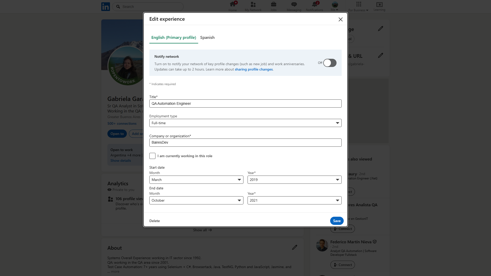
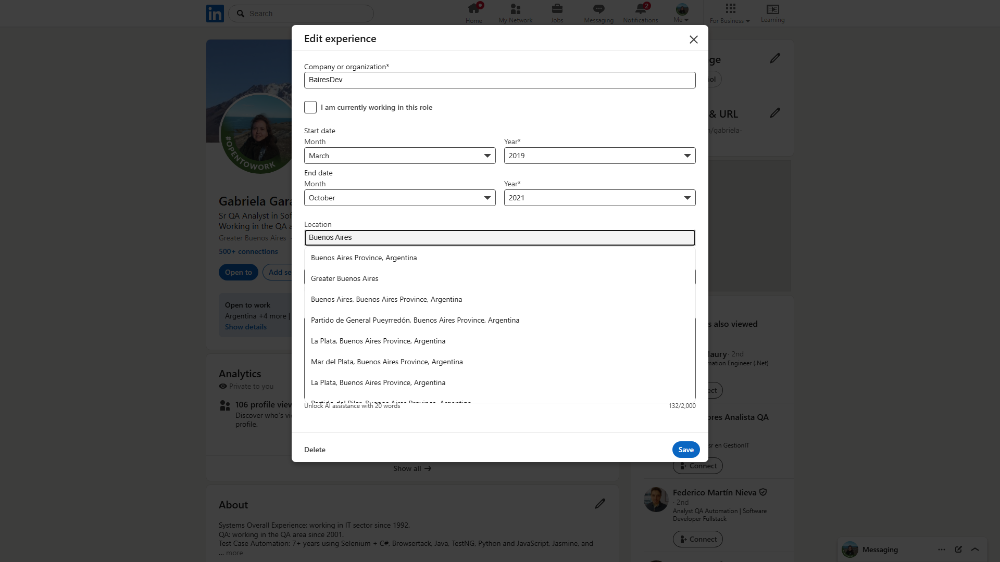
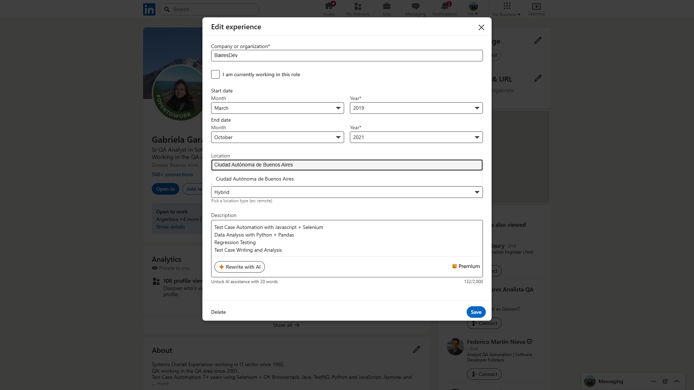
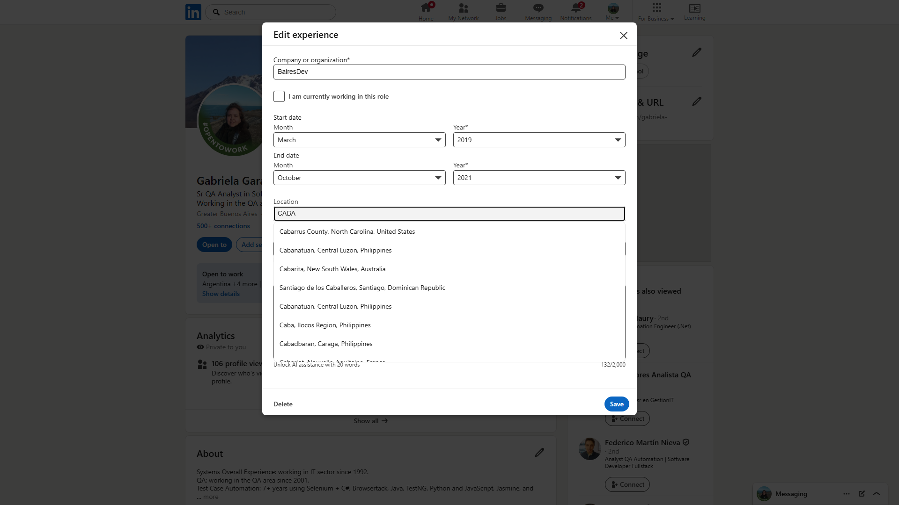

# Bug: el typeahead de "Location" no reconoce CABA (Ciudad Autónoma de Buenos Aires)

- **Producto/Área:** LinkedIn — edición de perfil → Experiencia → campo **Location**
- **API sospechada:** typeahead / estandarización de ubicaciones (países, provincias/estados, ciudades)
- **Afecta a:** usuarios que viven en **CABA** (Ciudad Autónoma de Buenos Aires, Argentina)
- **URL reportada:** `https://www.linkedin.com/in/gabriela-garayzavalia/edit/forms/position/1864390597/`
- **Severidad sugerida:** media (datos de ubicación incorrectos / no canónicos para CABA)
- **Estado del campo:** ya **no es restrictivo**: guarda texto libre, pero **no** mapea a una entidad geográfica canónica.

## Resumen

El autocompletado del campo **Location** del formulario de experiencia **no ofrece
"Ciudad Autónoma de Buenos Aires" (CABA)** como entidad de ubicación canónica, y
**confunde CABA con la Provincia de Buenos Aires (PBA)**. CABA es un distrito
federal autónomo, **no** forma parte de la Provincia de Buenos Aires; el typeahead
no modela esa distinción.

## Pasos de reproducción

1. Estar logueado en LinkedIn.
2. Ir a la URL del formulario de experiencia (arriba).
3. En el campo **Location**, escribir distintas variantes y observar las sugerencias.

## Resultado esperado vs. actual

| Entrada | Esperado | Actual (baseline) |
|---|---|---|
| `Buenos Aires` | Entre las sugerencias debería aparecer **"Ciudad Autónoma de Buenos Aires, Argentina"** como opción distinta de la provincia. | Solo aparecen entidades de la **Provincia de Buenos Aires (PBA)**: *"Buenos Aires Province, Argentina"*, *"Greater Buenos Aires"*, *"Buenos Aires, Buenos Aires Province, Argentina"* (anida la ciudad dentro de la provincia, **geográficamente incorrecto**), La Plata, Mar del Plata, etc. **No** ofrece CABA. |
| `Ciudad Autónoma de Buenos Aires` | Sugerencia canónica reconocida (entidad geográfica). | Devuelve **una sola** sugerencia que **repite el texto tal cual** → se guarda como **texto libre**, no como entidad estandarizada. |
| `CABA` (sigla) | Mapear a **Ciudad Autónoma de Buenos Aires, Argentina**. | Sugerencias **no relacionadas**: *Cabarrus County (EE.UU.)*, *Cabanatuan (Filipinas)*, *Cabarita (Australia)*, *Caba (Filipinas)*, etc. No reconoce la sigla argentina. |

## Análisis / causa raíz probable

La API de typeahead/estandarización de ubicaciones de LinkedIn:

1. **No tiene a CABA como entidad de ciudad/distrito** independiente para Argentina.
2. **Conflaciona** la Ciudad de Buenos Aires con la **Provincia** (PBA), llegando a
   anidar *"Buenos Aires, Buenos Aires Province, Argentina"* (incorrecto).
3. **No mapea la sigla "CABA"** al nombre oficial.

Como el campo dejó de ser restrictivo, el usuario puede escribir el texto libre,
pero la ubicación **no queda normalizada**, lo que afecta búsquedas, filtros y
segmentación por ubicación.

## Requerimiento de mejora

Propuesta formal para producto/ingeniería (API interna + combobox UI):

- [`docs/requirements/IMPROV-REQ-001-location-caba-api-combobox.md`](../../requirements/IMPROV-REQ-001-location-caba-api-combobox.md)

## Evidencia (baseline)

Formulario "Edit experience" cargado:



`Buenos Aires` → solo opciones de la Provincia (PBA), sin CABA:



`Ciudad Autónoma de Buenos Aires` → se acepta como texto libre (eco del input):



`CABA` (sigla) → sugerencias no relacionadas (EE.UU., Filipinas, Australia...):



## Suite de regresión ejecutable

Los casos del documento de QA están automatizados como tests asertivos:

- `Tests/LinkedIn/CabaLocationBugTest.cs` — categoría `CABA-Bug`. Afirma el
  comportamiento esperado (CABA como entidad). **Hoy FALLA** (evidencia del bug);
  pasará a verde cuando LinkedIn lo corrija.
- `Tests/LinkedIn/PbaLocationRegressionTest.cs` — categoría `PBA-Regression`.
  Verifica que las localidades de PBA siguen bien clasificadas. **Hoy PASA**;
  es la red de seguridad para validar que un futuro fix no rompa PBA.

Estado actual de la corrida (en vivo): **6 FAIL (CABA) / 5 PASS (PBA)**.

```bash
# Solo el bug de CABA (esperado: rojo)
dotnet test --filter "TestCategory=CABA-Bug" --settings .runsettings

# Solo regresión PBA (esperado: verde)
dotnet test --filter "TestCategory=PBA-Regression" --settings .runsettings
```

> Nota de implementación: el typeahead muestra la Provincia como
> **"Buenos Aires Province"** (no "Province of Buenos Aires", que es la traducción
> usada en el documento de QA).

## Cómo regenerar este baseline

```bash
dotnet test --filter "Name=ExplorarCampoLocation" --settings .runsettings
```

Las capturas y el `trace.zip` quedan en
`TestResults/baseline/ExplorarCampoLocation/` (no versionado).
Ver el trace con:

```bash
pwsh bin/Debug/net10.0/playwright.ps1 show-trace "TestResults/baseline/ExplorarCampoLocation/trace.zip"
```
