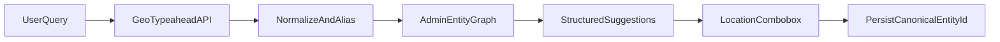

# IMPROV-REQ-001 — Mejora API de geo/typeahead y combobox Location (CABA vs PBA)

**Audiencia:** Equipo de producto e ingeniería de LinkedIn  
**Módulo:** User Profile → Experience → campo **Location**  
**Prioridad sugerida:** Media-Alta (integridad de datos geográficos)  
**Estado:** Propuesto  
**Relacionado:** [Bug CABA typeahead](../bugs/caba-location-typeahead/README.md)

**Exportar Word/PDF:** `pwsh tools/export-requerimiento-argentina-api.ps1`  
Genera: `Requerimiento = Argentina-API.docx` y `Requerimiento = Argentina-API.pdf` en esta carpeta.

---

## 1. Resumen ejecutivo

El autocompletado (typeahead) del campo **Location** en el formulario de experiencia **no modela a la Ciudad Autónoma de Buenos Aires (CABA)** como entidad geográfica canónica independiente de la **Provincia de Buenos Aires (PBA)**. El sistema confunde ambas jurisdicciones, ofrece sugerencias incorrectas o irrelevantes, y en algunos casos persiste **texto libre** en lugar de un **entityId** estandarizado.

Este documento solicita una mejora en:

1. **API interna** de typeahead / estandarización geo (backend).
2. **Patrón UI combobox** (frontend), alineado a mejores prácticas de accesibilidad y selección canónica.

La evidencia proviene de una suite de regresión automatizada (Playwright + NUnit) con casos de QA documentados. Los estándares **ISO 3166-2:AR** y **GeoNames** se citan solo como **referencia de modelado**; no se prescribe migrar a APIs externas comerciales.

---

## 2. Contexto de negocio (Argentina)

| Regla | Descripción |
|-------|-------------|
| CABA ≠ PBA | CABA es un **distrito federal autónomo**; **no** forma parte de la Provincia de Buenos Aires. |
| Ambigüedad | El término **"Buenos Aires"** sin aclaración es ambiguo → el sistema debe **desambiguar**, no asumir PBA. |
| Nomenclatura CABA | Divisiones: **48 barrios**, **15 comunas** (término exclusivo de CABA). |
| Nomenclatura PBA | Capital: **La Plata**. Divisiones: **Partidos** y **Municipios**. |
| Sigla CABA | Debe resolver a la entidad argentina, no a homónimos internacionales (Cabarrus County, Cabanatuan, etc.). |
| AMBA / GBA | Área metropolitana ≠ Provincia completa; no sustituye a CABA como entidad. |

**Etiquetas observadas en el typeahead de LinkedIn (inglés):**

- CABA esperada: `Autonomous City of Buenos Aires`
- PBA: `Buenos Aires Province` (no "Province of Buenos Aires")

---

## 3. Comportamiento actual vs. esperado

### 3.1 Síntomas consolidados

| Síntoma | Comportamiento actual | Comportamiento esperado | Evidencia (TC) |
|---------|----------------------|-------------------------|----------------|
| Búsqueda ambigua | Solo sugerencias PBA/GBA para `Buenos Aires` | CABA y PBA como opciones **separadas** | TC-L01 ❌ |
| Nombre completo CABA | Eco del input (`Ciudad Autónoma de Buenos Aires`) sin entidad canónica | Sugerencia con `entityId` canónico | TC-P01 ❌ |
| Sigla CABA | Sugerencias extranjeras (EE.UU., Filipinas, Australia) | Mapeo a CABA, Argentina | TC-P01 sigla ❌ |
| Barrios/comunas CABA | `Villa Riachuelo`, `Comuna 9` bajo PBA | Parent jurisdiction = CABA | TC-L02, TC-L04 ❌ |
| Persistencia tras Save | Texto libre ES persistido | Entidad canónica (`Autonomous City of Buenos Aires`) | TC-P01-Save ❌ |
| Regresión PBA | Localidades/partidos PBA correctos | Sin cambio tras el fix | TC-PBA01–04, TC-L03 ✅ |
| Locale browser | Mismo fallo en `es-AR` y `en-US` para L01 | Comportamiento coherente por locale/idioma de perfil | [locale-matrix](../test-cases/locale-matrix.md) |

### 3.2 Estado de la suite automatizada

- **CABA-Bug:** 6 tests — hoy **FAIL** (evidencia del defecto).
- **PBA-Regression:** 5 tests — hoy **PASS** (red de seguridad).
- **Negative (N01–N06):** PASS (campo no debe romperse con input inválido).
- **Locale-Matrix:** L01/P01 fallan; PBA01 pasa en ambos locales.

Índice completo: [`docs/test-cases/INDEX.md`](../test-cases/INDEX.md).

---

## 4. Requerimiento C — Mejora de la API interna de geo / typeahead

### 4.1 Flujo objetivo



### 4.2 Modelo de entidades (jerarquía administrativa)

La API debe modelar, como mínimo para Argentina:

| Entidad | Referencia | Parent |
|---------|------------|--------|
| CABA | ISO 3166-2 `AR-C`; capital federal | Argentina |
| PBA | ISO 3166-2 `AR-B` | Argentina |
| Barrios/comunas CABA | Nomenclatura local | CABA (no PBA) |
| Partidos/municipios PBA | Nomenclatura local | PBA |

**Reglas:**

- Prohibir anidaciones incorrectas del tipo `Buenos Aires, Buenos Aires Province, Argentina` cuando el usuario busca la **ciudad autónoma**.
- `Palermo`, `Villa Riachuelo`, `Comuna 9` → jurisdicción padre **CABA**.
- `Avellaneda`, `Lanús`, `Mar del Plata`, `La Plata`, `Partido de General Pueyrredón` → **PBA** (comportamiento actual correcto; no regresar).

### 4.3 Contrato de respuesta sugerido (typeahead)

Cada ítem del listbox debe ser una **entidad resoluble**, no un eco del texto ingresado:

```json
{
  "entityId": "urn:li:geo:...",
  "displayName": "Autonomous City of Buenos Aires",
  "localizedDisplayName": {
    "en": "Autonomous City of Buenos Aires",
    "es": "Ciudad Autónoma de Buenos Aires"
  },
  "adminLevel": "city",
  "parentEntity": {
    "entityId": "urn:li:geo:...",
    "displayName": "Argentina"
  },
  "countryCode": "AR",
  "disambiguationHint": "Distinct from Buenos Aires Province",
  "isCanonical": true
}
```

**Requisitos del contrato:**

- `entityId` obligatorio en toda sugerencia seleccionable.
- `localizedDisplayName` según idioma de perfil y locale del cliente.
- `disambiguationHint` cuando la query sea ambigua (`Buenos Aires`).
- Flag `isCanonical: false` solo si se permite texto libre explícito (ver sección 8).

### 4.4 Reglas de normalización y alias (backend)

| Input del usuario | Regla API |
|-------------------|-----------|
| `CABA`, `C.A.B.A.`, `Capital Federal` | Resolver a entidad CABA (AR) |
| `Buenos Aires` (sin contexto) | Devolver **múltiples** candidatos: CABA + PBA (+ GBA si aplica), ordenados por relevancia |
| `Ciudad Autónoma de Buenos Aires` | Entidad canónica; **prohibido** devolver solo eco del input |
| `Palermo`, `Comuna 9`, `Villa Riachuelo` | Parent = CABA |
| Queries extranjeras homónimas | No deben rankearse por encima de CABA cuando el contexto del perfil/sesión es Argentina |

### 4.5 Persistencia (Save)

- Al guardar, persistir **`entityId` canónico** y display name derivado del catágeo, no solo el string tipeado.
- TC-P01-Save demuestra el fallo actual: Save exitoso con Location opcional, pero valor persistido = `Ciudad Autónoma de Buenos Aires` (texto libre) sin normalización a `Autonomous City of Buenos Aires`.

### 4.6 Criterios de aceptación API

Tras implementar la mejora, deben cumplirse:

| Suite | Expectativa |
|-------|-------------|
| `TestCategory=CABA-Bug` | 6 tests en **verde** |
| `TestCategory=PBA-Regression` | 5 tests siguen en **verde** |
| `TestCategory=Locale-Matrix` | L01 y P01 pasan en `es-AR` y `en-US` |
| `TestCategory=Negative` | N01–N06 siguen en verde |

Comandos de verificación:

```powershell
dotnet test --filter "TestCategory=CABA-Bug" --settings .runsettings
dotnet test --filter "TestCategory=PBA-Regression" --settings .runsettings
dotnet test --filter "TestCategory=Locale-Matrix" --settings .runsettings
```

---

## 5. Requerimiento D — Mejores prácticas UI combobox / dropdown

Referencia: [WAI-ARIA APG — Combobox with autocomplete](https://www.w3.org/WAI/ARIA/apg/patterns/combobox/).

### 5.1 Patrón de interacción

| Práctica | Detalle |
|----------|---------|
| Rol ARIA | `role="combobox"` en el input; listbox asociado vía `aria-controls` / `aria-owns` |
| Estado | `aria-expanded`, `aria-activedescendant` durante navegación |
| Selección | El usuario debe **elegir un ítem del listbox** antes de Save, salvo política explícita de free text |
| Anti-patrón | **Prohibir** sugerencia única que replique el input sin `entityId` (observado en TC-P01) |
| Modo híbrido | Si Location es opcional y se admite free text: marcar visualmente como no canónico (`isCanonical: false`) |

### 5.2 UX de desambiguación

- Para `Buenos Aires`: mostrar **etiqueta secundaria** o agrupación que distinga:
  - Autonomous City of Buenos Aires (CABA)
  - Buenos Aires Province (PBA)
  - Greater Buenos Aires (GBA), si aplica
- Ordenar por relevancia geográfica y locale del usuario, no solo por popularidad global de homónimos.

### 5.3 Performance y robustez

| Práctica | Valor sugerido |
|----------|----------------|
| Debounce | 200–400 ms antes de invocar typeahead |
| Loading | Indicador mientras la API responde |
| Empty state | Sin sugerencias para input vacío/inválido (validado TC-N01–N06) |
| Error state | Mensaje inline sin romper el campo ni ejecutar scripts (TC-N04) |

### 5.4 Accesibilidad

- Teclado: `ArrowUp`/`ArrowDown` para navegar; `Enter` para seleccionar; `Escape` para cerrar.
- Screen reader: anunciar cantidad de resultados y ítem activo.
- No depender solo de mouse para completar Location.

### 5.5 Internacionalización (i18n)

- `displayName` coherente con **idioma del perfil** y locale del browser.
- Evitar mezclar español en sugerencias cuando el perfil está en inglés (fallo observado: P01 en `en-US` devuelve eco en ES).
- Mantener `entityId` estable entre locales; solo varía la presentación localizada.

---

## 6. Impacto y riesgos si no se implementa

| Área | Impacto |
|------|---------|
| Búsqueda y filtros | Usuarios en CABA mal clasificados bajo PBA o como texto libre |
| Recruiting / segmentación | Ofertas y candidatos geo-segmentados incorrectamente |
| Integridad de datos | Perfiles con ubicaciones no normalizadas, difíciles de deduplicar |
| Confianza del producto | Usuarios argentinos perciben error geográfico básico |
| Regresión futura | Sin suite PBA, un fix parcial podría romper localidades bonaerenses |

---

## 7. Evidencia y reproducibilidad

### 7.1 Capturas versionadas

`docs/bugs/caba-location-typeahead/evidence/`

- `01-formulario-cargado.png`
- `03-sugerencias-buenos-aires.png`
- `04-sugerencias-caba.png`
- `05-sugerencias-sigla-caba.png`

### 7.2 URL de reproducción

`https://www.linkedin.com/in/gabriela-garayzavalia/edit/forms/position/1864390597/`

### 7.3 Suite automatizada (repositorio cabaVsPBA)

| Archivo | Propósito |
|---------|-----------|
| `Tests/LinkedIn/CabaLocationBugTest.cs` | Asserts CABA (esperado FAIL hasta fix) |
| `Tests/LinkedIn/PbaLocationRegressionTest.cs` | Regresión PBA |
| `Tests/LinkedIn/CabaLocationSaveTest.cs` | Save + persistencia |
| `Tests/LinkedIn/LocaleLocationTest.cs` | Matriz locale |
| `Tests/LinkedIn/NegativeLocationTest.cs` | Robustez del campo |

Datos de prueba: `docs/test-data/location-test-data.json`.

---

## 8. Fuera de alcance y preguntas abiertas

| Tema | Pregunta para el equipo LinkedIn |
|------|----------------------------------|
| Free text | ¿Location seguirá siendo opcional con texto libre? (hoy TC-V01: **no requerido**) |
| Endpoint | ¿Cuál es el servicio interno exacto del typeahead geo? (no capturado en este análisis) |
| Migración de datos | ¿Se normalizarán perfiles existentes con texto libre "Ciudad Autónoma de Buenos Aires"? |
| APIs externas | Este requerimiento **no** solicita reemplazar el catágeo por Google Places/Mapbox; solo mejorar el modelo y contrato interno, alineado a estándares de referencia |

---

## Historial

| Fecha | Versión | Notas |
|-------|---------|-------|
| 2026-06-01 | 1.0 | Documento inicial basado en evidencia QA automatizada |
